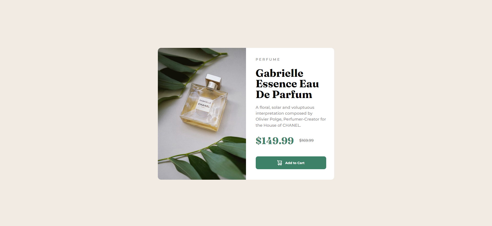

# Frontend Mentor - Product preview card component solution

This is a solution to the [Product preview card component challenge on Frontend Mentor](https://www.frontendmentor.io/challenges/product-preview-card-component-GO7UmttRfa). Frontend Mentor challenges help you improve your coding skills by building realistic projects. 

## Overview

### The challenge

Users should be able to:

- View the optimal layout depending on their device's screen size
- See hover and focus states for interactive elements

### Screenshot



## My process

### Built with

- Semantic HTML5 markup
- CSS custom properties
- Flexbox
- Desktop-first workflow

### What I learned

- Learned to import fonts without downloading them on Google Fonts

```css
@import url('https://fonts.googleapis.com/css2?family=Montserrat:wght@500;700&display=swap');
@import url('https://fonts.googleapis.com/css2?family=Fraunces:opsz,wght@9..144,700&display=swap');
```

- Learnt to make websites responsive to various evice layouts

```css
@media screen and (max-width: 480px) {
}
```

- Other minor things here and there

### Useful resources

- [Change cursor](https://stackoverflow.com/questions/3087975/how-to-change-the-cursor-into-a-hand-when-a-user-hovers-over-a-list-item) - This helped me change the cursor type to pointer when hovering over the button.
- [Make websites responsive](https://youtu.be/ZYV6dYtz4HA?si=dSKXh12FEC8mb_sB) - This video helped me understand how to change elements based on device layouts and really recommend this channel for learning CSS concepts.